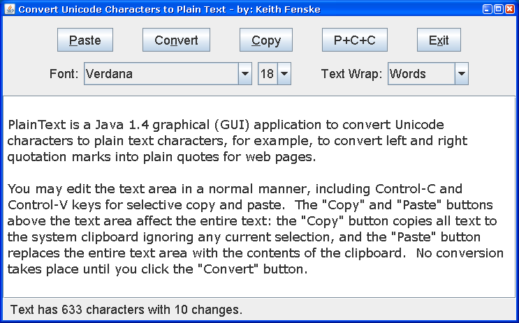

### Plain Text (Java)

by: Keith Fenske, https://kwfenske.github.io/

PlainText is a Java 1.4 graphical (GUI) application to convert Unicode
characters to plain text characters, for example, to convert left and right
quotation marks into plain quotes for web pages. Since everyone has a different
idea about what "plain text" means, a configuration file called PlainText3.txt
is expected to be in the current working directory and contains the character
conversion table. Edit this file so that it has only the changes you want.
Please read comments in the file for further instructions. See also any
"Character Map" application.

The program presents you with a single large text area and a few buttons or
options above. The typical sequence of actions is to copy text from a
Unicode-aware application such as Microsoft Word, switch to this Java
application, click the "Paste" and "Convert" buttons, then copy the converted
text to another application that expects a more limited character set.
Characters above U+FFFF are converted in extended Unicode form (UTF-32), if the
Java run-time co-operates (Java 5.0 or 7 or later, not Java 6).

Download the ZIP file here: https://kwfenske.github.io/plain-text-java.zip

Released under the terms and conditions of the Apache License (version 2.0 or
later) and/or the GNU General Public License (GPL, version 2 or later).

